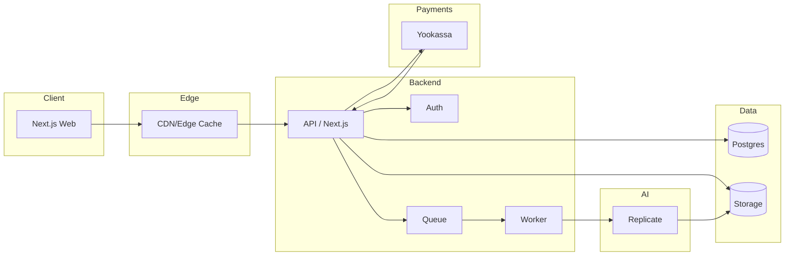

# Целевая архитектура платформы RoomGenius

Документ описывает целевую архитектуру и эволюцию RoomGenius от MVP к
масштабируемому продукту с контролем качества, стоимости и безопасности.

## Цели
- Быстрая генерация: от загрузки до результата <= 2-5 минут.
- Надежный трекинг задач, повторные попытки и идемпотентность.
- Безопасная обработка пользовательских данных и файлов.
- Прозрачное платежное окно и аудит операций.
- Наблюдаемость по задержкам, ошибкам и стоимости.

## Текущее состояние (MVP)
- Next.js UI и API routes.
- Supabase Storage для загрузок.
- Replicate для генерации.
- Yookassa планируется для платежей.

## Целевая архитектура (компоненты)
1. Клиент (Next.js, web)
2. API/Backend (Next.js API routes или отдельный сервис)
3. Auth (Supabase Auth или сторонний провайдер)
4. Storage (Supabase Storage)
5. База данных (Postgres)
6. Очередь и воркеры (фоновые задания)
7. Платежи (Yookassa)
8. Наблюдаемость (логи, метрики, трассировки)

## Диаграмма компонентов (упрощенно)
```
[Web/Client]
     |
     v
[API / Backend] -----> [Postgres]
     |   \                |
     |    \               v
     v     \          [Audit/Analytics]
[Storage]  \
     |      v
     |   [Queue] ---> [Worker] ---> [Replicate]
     |                               |
     v                               v
[Signed URLs]                   [Storage(Output)]
```

## Диаграмма потока данных (happy path)
```
1) Upload -> Storage
2) Create Job -> Postgres (status=queued)
3) Queue -> Worker
4) Worker -> Replicate -> Output URL
5) Save Output -> Storage + Postgres (status=completed)
6) UI polls/subscribes -> show result
7) Payment capture (policy-based)
```

## Ключевые решения
- Генерация асинхронная, чтобы избежать таймаутов HTTP.
- Доступ к Storage через signed URLs; секретные ключи не уходят в клиент.
- Промпты, стили, параметры модели и ссылки на файлы сохраняются в Postgres.
- Rate limiting и квоты на пользователя для контроля затрат.

## База данных (рекомендованная схема)
Минимальный набор таблиц для устойчивой работы:

- `users`
  - id, email, created_at, role
- `projects` (опционально, если один пользователь ведет несколько проектов)
  - id, user_id, title, created_at
- `jobs`
  - id, user_id, project_id, status, style, prompt,
    input_storage_path, output_storage_path,
    replicate_job_id, error_message,
    created_at, updated_at, completed_at
- `payments`
  - id, user_id, job_id, provider, status,
    amount, currency, provider_payment_id,
    created_at, updated_at
- `audit_log`
  - id, user_id, action, payload_json, created_at
- `rate_limits`
  - user_id, period, limit, used, reset_at

Индексы: по `jobs.user_id`, `jobs.status`, `payments.job_id`, `payments.status`.

## Очереди и воркеры
Цель: отделить генерацию от запросов клиента, управлять параллелизмом и
повторными попытками.

Варианты реализации:
- Postgres-очередь (pg-boss, simple LISTEN/NOTIFY) как стартовый вариант.
- Redis + BullMQ для высокой пропускной способности.
- Управляемые очереди (SQS) при росте нагрузки.

Критические требования:
- Идемпотентность: один job не должен генерироваться дважды.
- Ретрай политики: экспоненциальная задержка, max_attempts, DLQ.
- Тайм-ауты и cancelation для долгих задач.

## Безопасность
- Валидация файла по размеру и MIME на сервере и клиенте.
- Разделение бакетов: `uploads/` и `outputs/` с разными правами.
- Подписанные URL с коротким TTL для доступа к объектам.
- RLS-политики для Postgres (доступ только к своим job).
- Защита вебхуков Yookassa (проверка подписи).
- Ограничение токенов и ключей по принципу least privilege.
- Политика очистки: TTL для временных файлов и устаревших результатов.

## Наблюдаемость
- Метрики: время загрузки, время генерации, success rate, cost/job.
- Логи: job_id, user_id, ошибки внешних API.
- Трассировки: API -> worker -> Replicate -> storage.

## Платежный сценарий (варианты)
1) Pre-pay: пользователь платит до генерации.
2) Post-pay: платит после превью/водяного знака.
3) Hybrid: ограниченный free-tier + оплата за HD.

## Поэтапный план внедрения
**Этап 0. Стабилизация MVP**
- Ввести таблицу `jobs` и статусную модель.
- UI: отображение очереди и состояний.

**Этап 1. Асинхронная генерация**
- Очередь + воркер, перенос генерации из API.
- Ретрай и логирование ошибок.

**Этап 2. Платежи**
- Интеграция Yookassa, вебхуки, привязка payment -> job.
- Политика доступа к результату (до/после оплаты).

**Этап 3. Наблюдаемость и контроль затрат**
- Метрики, алерты, лимиты на пользователя.
- Квоты, free-tier, защита от злоупотреблений.

**Этап 4. Масштабирование**
- Горизонтальное масштабирование воркеров.
- Кэширование, оптимизация промптов и пайплайна.

## Full-stack архитектура (детально)
Ниже приведена полная картина стека от клиента до инфраструктуры.

### Уровни и ответственность
- Frontend (Web):
  - Next.js + React, Tailwind UI, клиентская валидация файлов.
  - Загрузка файлов через signed URL, трекинг статусов job.
  - Экран истории генераций и платежей.
- Backend/API:
  - Создание job, выдача signed URLs, управление статусами.
  - Бизнес-логика оплаты и доступ к результатам.
  - Rate limit, валидация, авторизация.
- Async/Workers:
  - Воркер читает job из очереди, вызывает Replicate.
  - Сохраняет результат в Storage, обновляет Postgres.
  - Идемпотентные ретраи и обработка тайм-аутов.
- Data:
  - Postgres: users, jobs, payments, audit_log.
  - Storage: uploads/ и outputs/ с ограниченными правами.
- Payments:
  - Создание платежа, подтверждение по вебхукам.
  - Привязка к job и политика доступа к результатам.
- Observability:
  - Логи с job_id и user_id.
  - Метрики latency/error rate/cost.
- CI/CD и инфраструктура:
  - Автоматический деплой, миграции, секреты, мониторинг.

### Диаграмма full-stack (mermaid)


## Рекомендованный стек реализации (вариант по умолчанию)
Этот стек совместим с текущим MVP и легко масштабируется.

- Web: Next.js 15 + React 18, Tailwind CSS.
- API: Next.js API routes (позже можно вынести в отдельный сервис).
- Auth: Supabase Auth (email/OTP/social).
- DB: Supabase Postgres.
- Storage: Supabase Storage.
- Queue: Redis + BullMQ (или pg-boss как старт).
- Workers: Node.js worker (Docker), масштабируемые инстансы.
- AI: Replicate API.
- Payments: Yookassa + webhook обработчик.
- Observability: Sentry (errors) + Prometheus/Grafana (metrics).
- Hosting:
  - Web/API: Vercel или Fly.io.
  - Worker: Render/Fly.io/AWS ECS.

## Контракты API (черновик)
Эндпоинты для стабильной full-stack реализации.

### POST /api/uploads/sign
Выдает signed URL для загрузки.
Request:
```json
{ "fileName": "room.jpg", "contentType": "image/jpeg" }
```
Response:
```json
{ "uploadUrl": "https://...", "path": "uploads/uuid.jpg" }
```

### POST /api/jobs
Создает задачу генерации.
Request:
```json
{ "inputPath": "uploads/uuid.jpg", "style": "modern" }
```
Response:
```json
{ "jobId": "uuid", "status": "queued" }
```

### GET /api/jobs/:id
Получение статуса и результата.
Response:
```json
{
  "jobId": "uuid",
  "status": "completed",
  "outputUrl": "https://...",
  "error": null
}
```

### GET /api/jobs?status=queued
Список задач пользователя.

### POST /api/payments
Создает платеж.
Request:
```json
{ "jobId": "uuid", "amount": 29900, "currency": "RUB" }
```
Response:
```json
{ "paymentId": "uuid", "confirmUrl": "https://..." }
```

### POST /api/webhooks/yookassa
Вебхук подтверждения платежа (валидация подписи обязательна).

## DDL (пример PostgreSQL)
```sql
create type job_status as enum ('queued','processing','completed','failed','cancelled');
create type payment_status as enum ('pending','succeeded','failed','refunded');

create table jobs (
  id uuid primary key,
  user_id uuid not null,
  status job_status not null default 'queued',
  style text not null,
  prompt text not null,
  input_storage_path text not null,
  output_storage_path text,
  replicate_job_id text,
  error_message text,
  created_at timestamptz not null default now(),
  updated_at timestamptz not null default now(),
  completed_at timestamptz
);

create table payments (
  id uuid primary key,
  user_id uuid not null,
  job_id uuid not null references jobs(id),
  provider text not null,
  provider_payment_id text,
  status payment_status not null default 'pending',
  amount integer not null,
  currency text not null default 'RUB',
  created_at timestamptz not null default now(),
  updated_at timestamptz not null default now()
);

create table audit_log (
  id uuid primary key,
  user_id uuid,
  action text not null,
  payload_json jsonb,
  created_at timestamptz not null default now()
);
```

## CI/CD (минимальный план)
- Lint + build на каждый PR.
- Проверка миграций и схемы БД.
- Автодеплой в staging, затем manual approve -> production.
- Секреты хранятся в secret manager.

## Инфраструктура и секреты
- Все ключи только в серверной среде (never in client).
- Переменные окружения:
  - REPLICATE_API_TOKEN
  - SUPABASE_SERVICE_ROLE_KEY
  - YOOKASSA_SECRET_KEY
- Обязательны rate limits и quotas.

## RLS-политики Supabase (пример)
Рекомендуется включить RLS по умолчанию и явно описывать доступ.

```sql
alter table jobs enable row level security;
alter table payments enable row level security;
alter table audit_log enable row level security;

create policy "jobs_select_own" on jobs
  for select using (auth.uid() = user_id);

create policy "jobs_insert_own" on jobs
  for insert with check (auth.uid() = user_id);

create policy "jobs_update_own" on jobs
  for update using (auth.uid() = user_id);

create policy "payments_select_own" on payments
  for select using (auth.uid() = user_id);

create policy "payments_insert_own" on payments
  for insert with check (auth.uid() = user_id);
```

Storage policies (Supabase Storage):
- `uploads/*` доступ на запись только для аутентифицированных пользователей.
- `outputs/*` доступ на чтение только владельцу job или по signed URL.
- Public buckets не использовать для чувствительных данных.

## Миграции и версия схемы
Минимально рекомендуемый процесс:
- Все изменения схемы в `supabase/migrations/*.sql`.
- Миграции именуются timestamp префиксом (YYYYMMDDHHMMSS).
- На CI: проверка, что миграции применимы и схема валидна.
- На deploy: `supabase db push` или применение SQL миграций.

Версионирование схемы:
- В Postgres хранить таблицу `schema_migrations` (или использовать встроенный
  механизм Supabase) для контроля примененных миграций.
- В релизных заметках фиксировать version id.

## SLO/SLI и надежность
Рекомендуемые SLO (начальные):
- Доступность API: 99.5% в месяц.
- Время генерации: P50 <= 90s, P95 <= 240s.
- Успешность генераций: >= 97% (не включая invalid input).

Ключевые SLI:
- latency_generate_p50/p95
- error_rate (5xx + failed jobs)
- queue_wait_time
- cost_per_job
- payment_success_rate

## Cost model (упрощенно)
Пример расчета стоимости на 1 job:
```
cost_job = cost_replicate + cost_storage + cost_egress + infra_overhead
```
Где:
- cost_replicate: цена за 1 запуск модели.
- cost_storage: хранение input/output (MB * price/GB/month).
- cost_egress: выдача результатов пользователю.
- infra_overhead: worker + API + observability.

Для контроля бюджета:
- лимиты по пользователям и тарифам,
- ограничение параллельных job,
- авто-очистка outputs через TTL.

## Спецификация worker pipeline
Рекомендуемая логика исполнения job:
1. Worker получает job из очереди.
2. Блокирует job: `SELECT ... FOR UPDATE SKIP LOCKED`.
3. Меняет статус на `processing`, пишет `started_at`.
4. Валидирует input (существует ли файл).
5. Запускает Replicate (с тайм-аутом).
6. Сохраняет output в Storage.
7. Обновляет job: `completed`, `completed_at`, `output_storage_path`.
8. При ошибке: статус `failed`, `error_message`, счетчик retry.

Повторные попытки:
- max_attempts = 3..5.
- экспоненциальная задержка + jitter.
- DLQ для неуспешных задач.

Идемпотентность:
- один job = один результат,
- повторный запуск не создает дубликат output,
- проверка `status` перед обработкой.

Отмена задач:
- `cancelled` статус,
- worker проверяет `cancelled` перед запуском и после долгих шагов.
